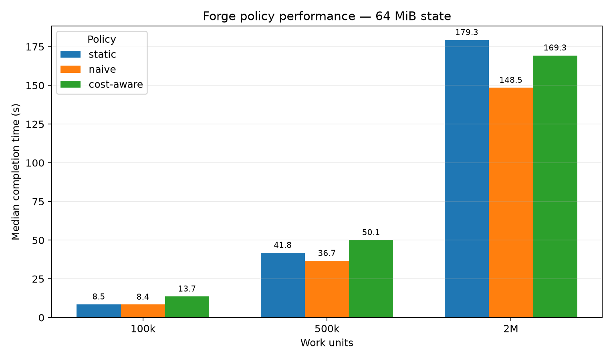
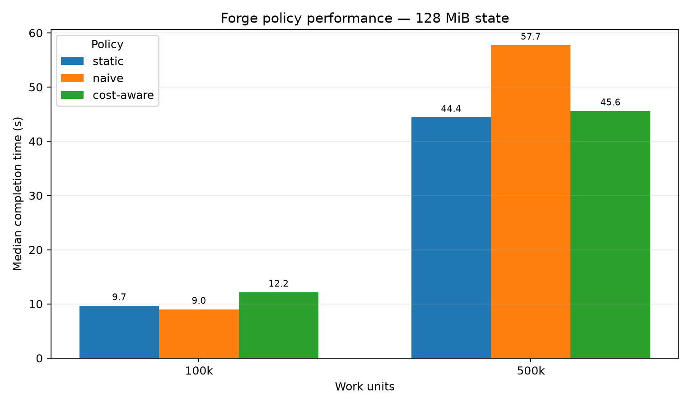
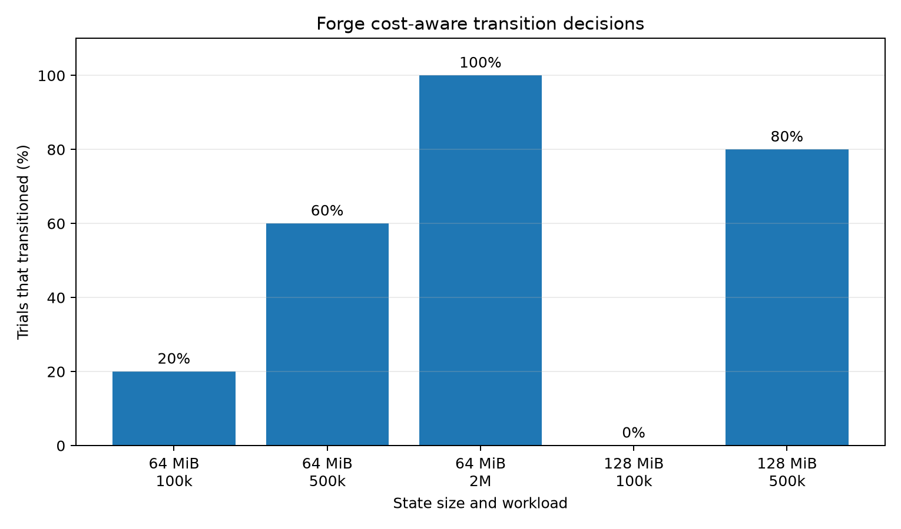

# Forge

**Cost-aware elastic execution for checkpointable distributed workloads.**

Forge is an experimental distributed execution system written in Go that can change the resource allocation of a running job.

Instead of treating scaling as free, Forge measures the cost of checkpointing and restoring workload state, learns workload throughput online, estimates whether additional resources will save enough future execution time to justify migration, and performs the transition only when the predicted benefit exceeds its cost.

A running job can therefore move through:

```text
RUNNING @ 2 GPU
      ↓
checkpoint
      ↓
reconfigure
      ↓
restore
      ↓
RUNNING @ 4 GPU
```

without restarting the job from the beginning.

Forge combines:

- distributed job scheduling
- worker leases and failure recovery
- checkpoint/restore execution
- elastic resource envelopes
- online workload performance modeling
- empirical transition-cost modeling
- cost-aware autoscaling
- PostgreSQL-backed state
- gRPC APIs
- Prometheus/Grafana observability
- reproducible benchmark and evaluation tooling

---

## Why Forge?

Elastic schedulers often make a simple assumption:

> If more resources make the workload faster, scale up.

For stateful workloads, that is incomplete.

Changing a running allocation can require:

1. preparing the workload,
2. checkpointing its state,
3. reconfiguring resources,
4. restoring the checkpoint,
5. resuming execution.

That transition can take milliseconds or several seconds depending on state size and runtime conditions.

Forge asks a different question:

> **Will the remaining execution-time savings exceed the measured cost of transitioning?**

Conceptually:

```text
expected_time_saved
    =
remaining_runtime
    -
remaining_runtime / expected_speedup

net_benefit
    =
expected_time_saved
    -
safe_transition_cost
```

Forge transitions only when the estimated net benefit clears the configured threshold.

This turns elasticity into a runtime cost/benefit decision rather than a fixed scaling rule.

---

# Architecture

```text
                         ┌─────────────────────┐
                         │      Forge CLI      │
                         │ submit/status/etc.  │
                         └──────────┬──────────┘
                                    │
                                    │ gRPC
                                    ▼
                         ┌─────────────────────┐
                         │    Coordinator      │
                         │                     │
                         │ queue + scheduling  │
                         │ leases              │
                         │ transition state    │
                         └───────┬──────┬──────┘
                                 │      │
                        PostgreSQL      │ gRPC
                                 │      │
                                 ▼      ▼
                         ┌─────────────────────┐
                         │       Worker        │
                         │                     │
                         │ Runtime Manager     │
                         │ Performance Model   │
                         │ Autoscaler          │
                         │ Process Executor    │
                         └──────────┬──────────┘
                                    │
                    checkpoint / reconfigure / restore
                                    │
                                    ▼
                         ┌─────────────────────┐
                         │  Elastic Workload   │
                         │                     │
                         │ progress.json       │
                         │ checkpoint.bin      │
                         │ allocation control  │
                         └─────────────────────┘
```

The coordinator owns persistent distributed state. Workers own local process state and continuously report health through leases.

For elastic workloads, the worker also maintains an online performance profile and periodically evaluates whether changing the current allocation is economically worthwhile.

---

# Elastic Resource Model

Jobs can request a GPU envelope rather than a single fixed allocation.

For example:

```text
minimum:    1 GPU
preferred:  2 GPU
maximum:    4 GPU
```

Submit an elastic workload:

```powershell
.\forge.exe submit "elastic --state-mb 64 --work 2000000" `
    --cpu 2 `
    --memory-mb 1024 `
    --gpu-min 1 `
    --gpu-preferred 2 `
    --gpu-max 4
```

A running job might initially receive:

```text
Allocation: CPU 2.00 | RAM 1024 MB | GPU 2
```

and later transition to:

```text
Allocation: CPU 2.00 | RAM 1024 MB | GPU 4
```

without restarting the workload from zero.

---

# Runtime Transition Protocol

Forge models a transition as a multi-stage operation:

```text
PREPARE
   ↓
CHECKPOINT
   ↓
RECONFIGURE
   ↓
RESTORE
   ↓
RESUME
```

For the process executor, the worker coordinates with the workload through signals and control files.

```text
Worker                           Workload

SIGUSR1 ───────────────────────► checkpoint state
                                write checkpoint.bin
                                write checkpoint.done

update allocation ─────────────► allocation file

SIGUSR2 ───────────────────────► restore checkpoint
                                restore progress/state
                                write restore.done
```

The worker records transition-stage latency and bytes moved so transition cost can be measured rather than assumed.

Example transition:

```powershell
.\forge.exe transition <job-id> --gpus 4
```

Inspect transition history:

```powershell
.\forge.exe transitions <job-id>
```

Example:

```text
TRANSITION    STATE                  SOURCE    TARGET
0011765c...   TRANSITION_COMPLETED   2 GPU     4 GPU
```

---

# Checkpointable Elastic Workload

`workloads/elastic` is a stateful benchmark workload used to exercise Forge's runtime transition path.

It:

- maintains mutable state,
- performs CPU work continuously,
- exposes logical parallelism through an allocation file,
- periodically writes progress telemetry,
- checkpoints both state and completed work,
- restores previous progress,
- continues execution after restore.

Example progress telemetry:

```json
{
  "completed": 1065784,
  "total": 3000000,
  "allocation": 4,
  "rate": 13079.24,
  "timestamp": "2026-09-26T23:42:05Z"
}
```

This allows Forge to observe actual workload throughput rather than relying on a hard-coded speedup table.

---

# Online Performance Model

Forge maintains an exponentially weighted moving estimate of workload throughput for each observed allocation.

Conceptually:

```text
allocation=2 GPU → observed throughput
allocation=4 GPU → observed throughput
```

From these observations Forge estimates:

```text
expected_speedup =
    target_rate / current_rate
```

and:

```text
remaining_runtime =
    remaining_work / current_rate
```

The performance model also handles restore-induced progress resets so checkpoint recovery does not corrupt throughput estimates.

---

# Transition Cost Model

Transition latency is not constant.

Forge includes benchmark tooling for measuring checkpoint and restore costs across state sizes and allocation changes.

Measured transition data is loaded by the cost model and used by the autoscaler.

The evaluation tooling includes several estimators:

- global median
- state-size median
- throughput-based estimator
- linear state-size estimator
- hybrid estimator

The hybrid estimator uses empirical observations for known state sizes and falls back to throughput-based estimation when direct observations are unavailable.

Model quality can be evaluated with:

```powershell
go run ./cmd/evaluate-costs `
    -input .\results\transition_costs_combined.csv
```

Evaluation uses both:

- leave-one-observation-out validation
- leave-one-state-size-out validation

so the model is tested both on known configurations and unseen state sizes.

---

# Cost-Aware Autoscaler

The autoscaler combines:

```text
live progress
     +
performance model
     +
transition cost model
     +
remaining runtime
     ↓
transition recommendation
```

A simplified decision is:

```text
if target_rate <= current_rate:
    STAY

expected_time_saved =
    remaining_runtime -
    remaining_runtime / speedup

safe_transition_cost =
    estimated_transition_cost × safety_multiplier

net_benefit =
    expected_time_saved -
    safe_transition_cost

if net_benefit >= minimum_required_benefit:
    TRANSITION
else:
    STAY
```

A cooldown prevents repeated oscillation between allocations.

The same policy can be inspected independently:

```powershell
go run ./cmd/recommend-transition `
    -data .\results\transition_costs_combined.csv `
    -state-mb 128 `
    -source-gpu 2 `
    -target-gpu 4 `
    -remaining 60s `
    -speedup 1.5 `
    -min-benefit 5s
```

---

# Experimental Evaluation

Forge was evaluated against three policies:

### Static

The workload remains at its initial 2-GPU allocation.

```text
2 GPU ─────────────────────────► completion
```

### Naive elastic

The workload eagerly transitions from 2 → 4 GPUs regardless of transition cost.

```text
2 GPU ── transition ──► 4 GPU ──► completion
```

### Cost-aware Forge

Forge observes workload performance and transition cost and decides whether the transition is worthwhile.

```text
2 GPU ──► evaluate economics
             │
             ├── STAY
             │
             └── TRANSITION → 4 GPU
```

Each configuration was measured across five trials.

The final evaluation contains **75 observations** across:

- 64 MiB checkpoint state
- 128 MiB checkpoint state
- multiple workload horizons
- static, naive, and cost-aware policies

Reproduce the analysis with:

```powershell
go run ./cmd/analyze-policy-evaluation `
    -input ".\results\policy_evaluation_64mib.csv,.\results\policy_evaluation_128mib.csv"
```

---

# Results

## 64 MiB checkpoint state

| Work | Static median | Naive median | Cost-aware median | Cost-aware transitions |
|---:|---:|---:|---:|---:|
| 100k | 8.548 s | 8.387 s | 13.656 s | 1 / 5 |
| 500k | 41.836 s | 36.651 s | 50.062 s | 3 / 5 |
| 2M | 179.289 s | 148.501 s | 169.344 s | 5 / 5 |

At this state size, transitions are relatively inexpensive and eager scaling performs well.

For the 2M workload:

```text
naive vs static:       +17.17%
cost-aware vs static:   +5.55%
cost-aware vs naive:   -14.04%
```

The result is intentionally not presented as a universal cost-aware win: when migration is cheap and additional parallelism is useful, eager resizing can outperform a conservative policy.



---

## 128 MiB checkpoint state

| Work | Static median | Naive median | Cost-aware median | Cost-aware transitions |
|---:|---:|---:|---:|---:|
| 100k | 9.664 s | 9.007 s | 12.158 s | 0 / 5 |
| 500k | 44.424 s | 57.727 s | 45.600 s | 4 / 5 |

The larger checkpoint changes the economics of resizing.

For the 500k workload:

```text
naive vs static:       -29.95%
cost-aware vs static:   -2.65%
cost-aware vs naive:   +21.01%
```

In this regime, blindly resizing every workload was expensive.

Forge's cost-aware policy achieved a **21.01% lower median completion time than naive resizing**, while remaining within **2.65% of static execution**.



---

# Adaptive Decision Behavior

The cost-aware policy did not simply scale every job.

Measured transition frequency:

| State | Work | Transitions |
|---:|---:|---:|
| 64 MiB | 100k | 1 / 5 |
| 64 MiB | 500k | 3 / 5 |
| 64 MiB | 2M | 5 / 5 |
| 128 MiB | 100k | 0 / 5 |
| 128 MiB | 500k | 4 / 5 |

The transition frequency changes with workload horizon and observed runtime economics.



This is the core behavior Forge is designed to explore:

> **Elasticity should be a runtime economic decision, not an unconditional reaction to available capacity.**

---

# What the Results Do — and Do Not — Show

The experiments show that Forge can:

- measure real checkpoint/restore overhead,
- learn workload throughput online,
- alter the allocation of a running stateful workload,
- preserve progress across checkpoint/restore,
- make different scaling decisions for different workload conditions,
- avoid unconditional resizing,
- outperform eager resizing in a measured high-transition-cost regime.

The experiments do **not** establish that cost-aware scheduling always beats static or eager allocation.

In particular, the 64 MiB experiments show cases where naive resizing is faster.

The current controller is sensitive to:

- performance-model calibration,
- transition-cost estimates,
- runtime variance,
- sampling interval,
- safety multiplier,
- minimum-benefit threshold.

The benchmark is therefore best interpreted as a systems experiment in **transition-aware elastic scheduling**, rather than a claim of universal scheduler optimality.

---

# Reliability

Forge's concurrency-heavy components are tested under Go's race detector.

```bash
go test -race ./...
```

The final implementation passes:

```text
go vet ./...
go test -count=1 ./...
go test -race ./...
```

Core packages include tests for:

- resource accounting
- queue behavior
- retry logic
- worker runtime management
- transition execution
- checkpoint/restore coordination
- cost estimators
- leave-one-out evaluation
- online performance modeling
- autoscaler policy behavior
- cooldown enforcement

---

# Running Forge

## Requirements

- Go 1.23+
- Docker
- Docker Compose
- PostgreSQL through the included Compose stack

Start the system:

```bash
docker compose up -d --build
```

Check services:

```bash
docker compose ps
```

Build the CLI:

```bash
go build -o forge ./cmd/client
```

On Windows:

```powershell
go build -o forge.exe ./cmd/client
```

---

# Submit a Job

```powershell
.\forge.exe submit "elastic --state-mb 64 --work 500000" `
    --cpu 2 `
    --memory-mb 1024 `
    --gpu-min 1 `
    --gpu-preferred 2 `
    --gpu-max 4
```

Example:

```text
Job submitted successfully

CPU:      2.00 cores
Memory:   1024 MB
GPUs:     min=1 preferred=2 max=4
```

Check status:

```powershell
.\forge.exe status <job-id>
```

Inspect transitions:

```powershell
.\forge.exe transitions <job-id>
```

---

# Manual Transition

Forge also exposes transitions directly for debugging and benchmarking:

```powershell
.\forge.exe transition <job-id> --gpus 4
```

A completed transition updates both the coordinator's persisted allocation and the workload's live allocation control file.

---

# Benchmarking Transition Cost

Run the transition benchmark:

```powershell
.\benchmarks\transition_benchmark.ps1
```

Analyze measurements:

```powershell
go run ./cmd/analyze-costs `
    -input .\results\transition_costs_combined.csv
```

Evaluate estimators:

```powershell
go run ./cmd/evaluate-costs `
    -input .\results\transition_costs_combined.csv
```

---

# Reproducing Policy Evaluation

Evaluation scripts live under:

```text
benchmarks/evaluation/
```

The evaluation compares:

```text
static
naive
cost-aware
```

Raw measurements are stored under:

```text
results/
```

Analyze the final datasets:

```powershell
go run ./cmd/analyze-policy-evaluation `
    -input ".\results\policy_evaluation_64mib.csv,.\results\policy_evaluation_128mib.csv"
```

Generate figures:

```powershell
python .\scripts\plot_policy_evaluation.py
```

Generated plots are written to:

```text
docs/images/
```

---

# Repository Structure

```text
forge/
├── cmd/
│   ├── analyze-costs/
│   ├── analyze-policy-evaluation/
│   ├── client/
│   ├── coordinator/
│   ├── evaluate-costs/
│   ├── recommend-transition/
│   └── worker/
│
├── internal/
│   ├── autoscaler/
│   ├── coordinator/
│   ├── costmodel/
│   ├── metrics/
│   ├── performance/
│   ├── queue/
│   ├── resource/
│   ├── retry/
│   ├── storage/
│   ├── transition/
│   ├── transitionpolicy/
│   └── worker/
│
├── workloads/
│   ├── checkpointable/
│   └── elastic/
│
├── benchmarks/
│   ├── transition_benchmark.ps1
│   └── evaluation/
│
├── results/
├── scripts/
├── docs/
│   └── images/
├── proto/
├── docker-compose.yml
├── Dockerfile
└── go.mod
```

---

# Design Principles

### Measure rather than assume

Transition cost and workload speedup are derived from observations rather than fixed constants.

### Separate distributed and local state

The coordinator persists job and transition state; workers own local process/runtime state.

### Make transitions explicit

Checkpoint, reconfiguration, restore, and resume are modeled as distinct stages with measurable latency.

### Prefer safe decisions

Transition estimates include a safety multiplier and minimum-benefit threshold.

### Evaluate against baselines

Forge is compared against both fixed allocation and unconditional elastic scaling.

### Report negative results

The evaluation includes regimes where cost-aware scheduling does not outperform the simpler baselines.

---

# Current Limitations

Forge is a research-oriented prototype, not a production cluster scheduler.

Current limitations include:

- GPU counts are logical resource allocations in the benchmark environment rather than physical CUDA device migration.
- The elastic workload is synthetic.
- Performance profiles are maintained in worker memory and are lost when the worker restarts.
- The current cost model is trained from a relatively small transition dataset.
- Evaluation was performed on a single-machine Docker environment.
- The autoscaler currently evaluates a small resource envelope rather than performing general cluster-wide optimization.
- The policy uses heuristic safety and minimum-benefit thresholds rather than uncertainty-aware optimization.
- Multi-worker live migration is not yet implemented.

These limitations are deliberate boundaries for the current prototype and provide clear directions for future work.

---

# Future Work

Potential extensions include:

- persistent workload-performance profiles,
- confidence intervals for transition-cost predictions,
- uncertainty-aware scaling decisions,
- online transition-cost learning,
- multi-worker migration,
- real GPU workloads,
- heterogeneous accelerators,
- interference-aware scheduling,
- predictive resource demand,
- cluster-wide optimization,
- learned policies trained from historical executions.

---

# Technology

Forge is built with:

- **Go**
- **gRPC**
- **Protocol Buffers**
- **PostgreSQL**
- **Docker / Docker Compose**
- **Prometheus**
- **Grafana**
- **Python / Matplotlib** for reproducible evaluation figures

---

# Testing

Run all tests:

```bash
go test ./...
```

Run static analysis:

```bash
go vet ./...
```

Run the race detector:

```bash
go test -race ./...
```

Run selected concurrency-heavy packages repeatedly:

```bash
go test -count=20 \
    ./internal/worker \
    ./internal/autoscaler \
    ./internal/transition \
    ./internal/storage \
    ./internal/queue \
    ./internal/performance \
    ./internal/costmodel
```

---

# Summary

Forge explores one question:

> **When is changing the resources of a running stateful workload actually worth it?**

It combines distributed execution, checkpoint/restore, live workload telemetry, empirical transition-cost modeling, online performance estimation, and autonomous cost-aware scheduling into a single working system.

The evaluation shows why that decision cannot be reduced to simply allocating more resources: eager scaling performs well when transition cost is low, but can become counterproductive as state-transfer cost grows.

Forge makes that tradeoff explicit, measurable, and executable.